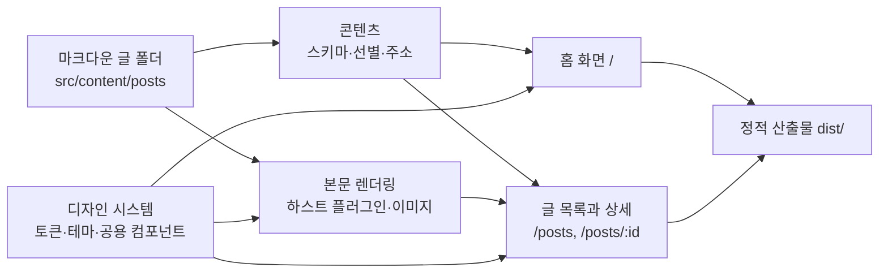

# 기록의 지도 — 글로벌 아키텍처 가이드

## 시스템 개요

저장소에 커밋한 마크다운을 정적 HTML로 빌드해 배포하는 개인 블로그다. 서버 런타임과 데이터베이스가 없고, 글의 원본은 `src/content/posts` 아래의 글 폴더 그 자체다.

세 화면(`/`, `/posts`, `/posts/<post.id>`)이 전부이며, 브라우저에서 도는 코드는 테마 전환과 모든 글 화면의 검색·정렬·무한 스크롤 두 갈래뿐이다. 나머지는 모두 빌드 시점에 끝난다.

## 도메인 구성

| 도메인 | 책임 | 문서 |
| --- | --- | --- |
| 콘텐츠(CONTENT) | 프론트매터 스키마, 초안 판정, 글 선별, 읽기 시간, 주소 생성, 검색 색인 | [`도메인_문서/콘텐츠(CONTENT)/`](도메인_문서/콘텐츠(CONTENT)/01_도메인_개요.md) |
| 본문 렌더링(RENDER) | 소제목 앵커, 이미지 폭 표기, 코드 하이라이팅, 본문 조판, 이미지 최적화 | [`도메인_문서/본문_렌더링(RENDER)/`](도메인_문서/본문_렌더링(RENDER)/01_도메인_개요.md) |
| 디자인 시스템(DESIGN) | 토큰, 두 테마, 페이지 골격, 공용 컴포넌트 | [`도메인_문서/디자인_시스템(DESIGN)/`](도메인_문서/디자인_시스템(DESIGN)/01_도메인_개요.md) |
| 홈 화면(HOME) | `/`의 머리말, 지식 맵 격자, 최신 글 목록 | [`도메인_문서/홈_화면(HOME)/`](도메인_문서/홈_화면(HOME)/01_도메인_개요.md) |
| 글 목록과 상세(POST) | `/posts`의 검색·정렬·무한 스크롤, `/posts/<post.id>`의 본문·목차·이어 볼 글 | [`도메인_문서/글_목록과_상세(POST)/`](도메인_문서/글_목록과_상세(POST)/01_도메인_개요.md) |

이 다섯 도메인은 계획서의 열한 개 도메인을 성격에 따라 묶은 것이다. 각 문서의 머리에 어느 계획서에서 왔는지 적어 두었다.

| 계획서 도메인 | 문서 도메인 |
| --- | --- |
| BLOG, BASE(data), ROUTE | 콘텐츠(CONTENT) |
| PROSE, IMAGE | 본문 렌더링(RENDER) |
| THEME, BASE(token), UI, TAG | 디자인 시스템(DESIGN) |
| HOME | 홈 화면(HOME) |
| ARCHIVE, POST | 글 목록과 상세(POST) |

### 도메인 간 통신

네트워크 호출이 없다. 모든 통신은 빌드 시점의 모듈 임포트와 컴포넌트 props로 이뤄진다.

| 호출자 | 피호출자 | 방식 | 목적 |
| --- | --- | --- | --- |
| 홈 화면 | 콘텐츠 | 함수 호출 | `getMapPosts`, `getRecentPosts`로 그릴 글을 받는다 |
| 글 목록과 상세 | 콘텐츠 | 함수 호출 | `getVisiblePosts`, `toSearchEntries`, `getRelatedPost`, `toSlugPath` |
| 글 목록과 상세 | 본문 렌더링 | 컴포넌트 조합 | `Prose`로 변환된 본문을 감싼다 |
| 본문 렌더링 | 콘텐츠 | 빌드 파이프라인 | 마크다운 변환 결과와 `headings`를 콘텐츠 컬렉션이 실어 나른다 |
| 홈·글 목록과 상세·본문 렌더링 | 디자인 시스템 | 토큰 참조와 컴포넌트 조합 | 색·서체·간격과 `BaseLayout`, 공용 컴포넌트 |

## 기술 스택

| 계층 | 사용 기술 | 비고 |
| --- | --- | --- |
| 런타임 | Node.js | `engines`에 `>=22.12.0` |
| 프레임워크 | Astro `^7.2.8` | 정적 출력. 서버 어댑터 없음 |
| 언어 | TypeScript, Astro 컴포넌트 | `src/lib`은 TypeScript |
| 스타일 | Tailwind CSS `^4.3.3`, `@tailwindcss/vite` | 토큰은 `@theme static` |
| 마크다운 | `@astrojs/markdown-satteri`, Shiki | 하스트 플러그인 두 개 등록 |
| 스키마 검증 | Zod(`astro:content`) | 프론트매터 |
| 이미지 | `sharp` `^0.35.4` | 개발 의존성. 커밋 전 변환 |
| 슬러그 | `github-slugger` `^2.0.0` | 소제목 `id` |
| 데이터 저장소 | 없음 | 마크다운 파일이 원본이다 |

## 인프라

빌드 산출물 `dist/`를 정적 호스팅에 올리는 구조다. 서버 프로세스가 없으므로 환경 구분도 빌드 모드 하나로 갈린다.

| 항목 | 내용 |
| --- | --- |
| 배포 방식 | `npm run build`로 만든 `dist/`를 정적 호스팅에 올린다 |
| 환경 구분 | 개발 서버(`astro dev`)와 운영 빌드(`astro build`) 두 가지. `import.meta.env.PROD`로 갈린다 |
| 환경별 차이 | 초안 글이 개발에서만 보인다. 그 밖의 동작은 같다 |
| 환경 변수 | 쓰지 않는다 |
| 로그와 모니터링 | 빌드 로그가 유일한 관찰 지점이다. 런타임 로그 수집기는 두지 않는다 |
| 저장소 제외 | `node_modules`와 `dist`는 추적하지 않는다 |

개발 서버는 배경 모드로 띄우고 `astro dev stop`, `astro dev status`, `astro dev logs`로 관리한다.

## 공통 보안 원칙

인증과 인가의 세부 규칙은 [`공통_인프라_및_컨벤션/인증_및_인가_가이드.md`](공통_인프라_및_컨벤션/인증_및_인가_가이드.md)에 둔다. 여기에는 시스템 전반에 적용되는 원칙만 적는다.

1. 사용자 입력을 서버로 보내지 않는다. 검색은 브라우저 안에서 끝나고 폼 제출이 네트워크를 타지 않는다.
2. 개인 정보를 수집하거나 저장하지 않는다. 브라우저에 남기는 값은 테마 선택 하나뿐이다.
3. 초안 글은 운영 빌드의 산출물에 경로조차 만들지 않는다. 감추는 것이 아니라 내보내지 않는 방식으로 막는다.
4. 외부에서 받아 오는 자원은 Google Fonts 하나이며, 받지 못해도 화면이 읽히도록 대체 서체를 둔다.
5. 사용자 입력을 HTML로 해석하는 자리를 만들지 않는다. `set:html`은 저장소에 커밋된 검색 색인을 직렬화할 때만 쓴다.
6. 브라우저 저장소 접근은 실패할 수 있다고 보고 언제나 예외를 삼킨다.

## 공통 컨벤션

| 대상 | 규칙 |
| --- | --- |
| 글 주소 | `/posts/` + `post.id`. `post.id`는 `src/content/posts` 기준 폴더 경로다. 발행일을 접두사로 붙이지 않는다 |
| 글 폴더 | `<이름>/index.md`와 그 글의 이미지를 같은 폴더에 둔다 |
| 조작 식별자 | 스크립트와 검증이 찾는 요소에 `data-od-id`를 붙인다. 클래스 이름으로 찾지 않는다 |
| 색과 크기 | `global.css`의 `@theme static`에만 적고 컴포넌트는 참조한다 |
| 다크 테마 | 색상 토큰 재정의로 처리하고, 토큰으로 표현되지 않는 속성에만 `dark:` 변형을 쓴다 |
| 접근 가능한 이름 | 항목 전체를 링크로 감쌀 때 `aria-labelledby`로 제목만 가리킨다 |
| 조작 크기 | 아이콘 버튼의 터치 영역은 최소 높이 44px |
| 진행형 향상 | 스크립트가 필요한 조작은 초기 `hidden`으로 두고 스크립트가 드러낸다 |
| 주석 | 무엇을 하는지가 아니라 왜 그렇게 했는지를 적는다 |
| 에러 응답 형식 | [`공통_에러_코드.md`](공통_인프라_및_컨벤션/공통_에러_코드.md) 참조 |
| 명명 규칙 | 컴포넌트는 파스칼 케이스, 모듈 함수는 카멜 케이스, CSS 토큰은 케밥 케이스 |
| 브랜치 | 기능 브랜치를 상위 브랜치에 리베이스한 뒤 fast-forward로 합친다. 머지 커밋을 만들지 않는다 |
