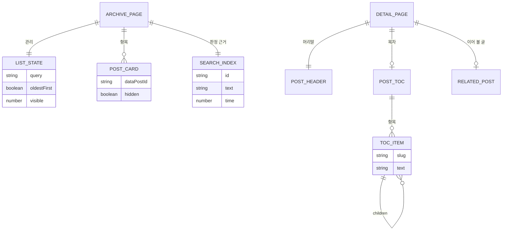

# 글 목록과 상세(POST) — 도메인 모델

## 엔티티와 값 객체

| 이름 | 구분 | 역할 |
| --- | --- | --- |
| 목록 상태 | 값 객체 | 검색어, 정렬 방향, 노출 개수 세 값. 화면 스크립트 한 곳이 관리한다 |
| 검색 색인 | 값 객체 | `toSearchEntries`가 만든 배열. `<script type="application/json">`으로 페이지에 실린다 |
| `PostCard` | 값 객체 | 목록 항목. `data-post-id`로 검색 항목과 짝을 이룬다 |
| `TocItem` | 값 객체 | 목차 항목 하나. `h3`를 `children`에 담아 두 단계를 만든다 |
| `RelatedPost` | 값 객체 | 이어 볼 글 링크. 값이 없으면 아예 그리지 않는다 |

### 생명 주기

목록 상태는 페이지를 열 때 `{ query: '', oldestFirst: false, visible: 20 }`으로 시작한다. 검색 제출과 정렬 전환은 각각 해당 값을 바꾸고 노출 개수를 20으로 되돌린 뒤 다시 그리며, 감시 요소가 화면에 들어오면 노출 개수만 10 늘린다. 상태는 어디에도 저장하지 않으므로 새로 고치면 초깃값으로 돌아간다.

다시 그릴 때는 고른 결과의 순서대로 항목을 목록 끝에 옮겨 붙이고, 드러낼 집합에 없는 항목은 `hidden`으로 감춘다. 요소를 만들거나 지우지 않고 순서와 표시 여부만 바꾸므로 상세 화면으로 갔다 돌아와도 마크업이 그대로다.

목차 항목은 빌드 시점에 `render(post)`가 돌려준 `headings`를 훑어 한 번 만들어진다. `h2`를 만나면 바깥 목록에 넣고 `h3`는 직전 항목의 `children`에 담는다.

## 데이터베이스 스키마

해당 없음. 저장소를 쓰지 않는다. 목록 상태는 메모리에만 있고 검색 색인은 페이지에 함께 실린다. 아래는 그 대신 화면이 의존하는 DOM 계약이다.

### 목록 화면의 DOM 계약

| 선택자 | 역할 | 제약 조건 |
| --- | --- | --- |
| `[data-od-id="all-posts-list"]` | 화면 전체 영역 | 아래 요소를 모두 이 안에서 찾는다 |
| `[data-od-id="post-search-entries"]` | 검색 색인 JSON | `SearchEntry[]`를 담는다 |
| `[data-od-id="post-search"]` | 검색 폼 | 초기 `hidden`. 스크립트가 드러낸다 |
| `[data-od-id="sort-toggle"]` | 정렬 버튼 | 초기 `hidden`. 스크립트가 드러낸다 |
| `[data-od-id="sort-icon-desc"]` / `[data-od-id="sort-icon-asc"]` | 두 화살표 | 언제나 하나만 보인다 |
| `[data-od-id="post-list"]` | 항목을 담는 `ul` | 항목 순서를 여기서 바꾼다 |
| `[data-post-id]` | 항목 `li` | 값이 `SearchEntry.id`와 같아야 짝이 맞는다 |
| `[data-od-id="post-list-region"]` | 목록 감싸개 | 결과가 없으면 감춘다 |
| `[data-od-id="no-results"]` | 결과 없음 안내 | 초기 `hidden` |
| `[data-od-id="section-note"]` | 결과 요약 | `총 N편`으로 갱신한다 |
| `[data-od-id="scroll-sentinel"]` | 감시 요소 | 더 드러낼 글이 없으면 감춘다 |

### 인덱스와 제약

| 대상 | 종류 | 이유 |
| --- | --- | --- |
| `data-post-id` ↔ `SearchEntry.id` | 짝 맞춤 | 항목을 `Map`에 담아 상수 시간으로 찾는다 |
| `INITIAL_VISIBLE` = 20 | 상한 | 첫 화면이 차고도 남을 만큼 잡은 값 |
| `VISIBLE_STEP` = 10 | 증가폭 | 감시 요소가 한 번 걸릴 때 늘리는 수 |
| `SENTINEL_MARGIN` = `0px 0px 200px 0px` | 여유 거리 | 목록 끝이 눈에 보이기 전에 다음 묶음을 붙인다 |
| `post-card-title-<post.id>` | 문서 내 유니크 | `aria-labelledby`가 가리키는 제목 `id` |
| 목차 계층 | 최대 두 단계 | `h2`와 `h3`만 앵커를 받는다 |
