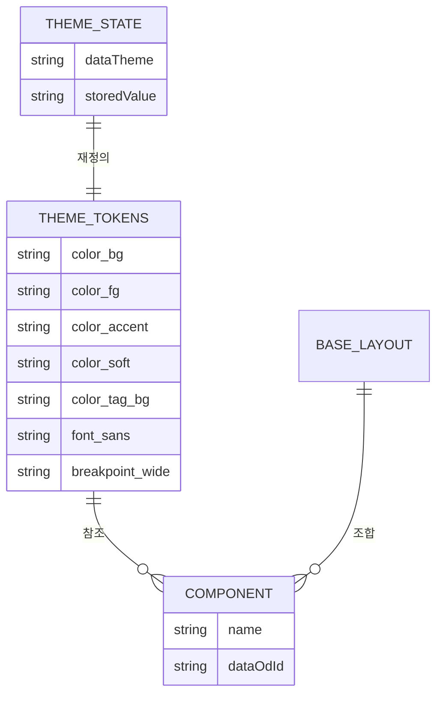

# 디자인 시스템(DESIGN) — 도메인 모델

## 엔티티와 값 객체

| 이름 | 구분 | 역할 |
| --- | --- | --- |
| 토큰 집합 | 값 객체 | `@theme static` 블록의 색·서체·크기·간격 정의 |
| 테마 상태 | 값 객체 | `document.documentElement.dataset.theme`와 `localStorage.theme` 한 쌍 |
| `BaseLayout` | 엔티티 | 모든 페이지가 감싸이는 골격. `<head>`와 헤더·본문·푸터를 담는다 |
| 공용 컴포넌트 | 값 객체 | 화면이 조합해 쓰는 표현 단위. 상태를 갖지 않는다 |

### 생명 주기

테마 상태는 페이지를 열 때 인라인 스크립트가 정한다. 저장 값을 먼저 보고, 없거나 알 수 없는 값이면 `prefers-color-scheme`으로 넘어간다. 정해진 값은 `<html data-theme>`에 곧바로 찍히므로 첫 페인트부터 올바른 색이 나온다.

이후 사용자가 토글을 누르면 `data-theme`이 뒤집히고 같은 값이 `localStorage`에 저장되며, 버튼의 접근 가능한 이름과 상태 문구가 다시 그려진다. 저장이 막혀 있으면 그 세션 안에서만 전환이 유지되고 다음 방문에는 시스템 설정으로 돌아간다.

## 데이터베이스 스키마

해당 없음. 서버 저장소가 없다. 유일하게 지속되는 상태는 브라우저 `localStorage`에 있으므로 그 규약을 대신 적는다.

### `localStorage`

| 키 | 타입 | 제약 조건 | 설명 |
| --- | --- | --- | --- |
| `theme` | `string` | `'light'` 또는 `'dark'` | 사용자가 마지막으로 고른 테마. 다른 값은 무시하고 시스템 설정을 따른다 |

### 색상 토큰

| 토큰 | 라이트 | 다크 | 용도 |
| --- | --- | --- | --- |
| `--color-bg` | `oklch(98% 0.008 95)` | `oklch(17% 0.018 260)` | 페이지 배경 |
| `--color-surface` | `oklch(100% 0 0)` | `oklch(22% 0.022 260)` | 표 머리, 콜아웃 배경 |
| `--color-fg` | `oklch(24% 0.025 260)` | `oklch(93% 0.012 95)` | 본문 글자 |
| `--color-muted` | `oklch(51% 0.025 260)` | `oklch(72% 0.018 260)` | 보조 글자 |
| `--color-border` | `oklch(88% 0.018 260)` | `oklch(34% 0.025 260)` | 구분선과 테두리 |
| `--color-accent` | `oklch(50% 0.14 215)` | `oklch(76% 0.13 205)` | 링크와 강조 |
| `--color-soft` | `oklch(93% 0.035 215)` | `oklch(29% 0.045 215)` | 지식 맵 중심 글과 노드 호버 배경 |
| `--color-tag-bg` | `oklch(94% 0.012 260)` | `oklch(27% 0.022 260)` | 태그 배경 |
| `--color-on-accent` | `oklch(98% 0.008 95)` | `oklch(17% 0.018 260)` | 강조색 위의 글자 |

`--color-code-bg`, `--color-link-hover`, `--focus-ring`은 다른 토큰에서 파생한다. `--color-success`와 `--color-danger`는 두 테마 공통이다.

### 크기와 배치 토큰

| 토큰 | 값 | 용도 |
| --- | --- | --- |
| `--spacing` | `0.25rem` | 간격 단위. `DESIGN.md`의 `--space-1`~`--space-16`이 이 배수와 일치한다 |
| `--font-sans` | `"Noto Sans KR", ui-sans-serif, …` | 본문과 UI 서체 |
| `--font-mono` | `ui-monospace, SFMono-Regular, …` | 날짜와 코드 |
| `--text-display` ~ `--text-caption` | `clamp()` 또는 고정값 | 글자 크기 위계 |
| `--leading-tight` / `--leading-body` / `--leading-meta` | `1.2` / `1.85` / `1.45` | 줄 간격 |
| `--radius-sm` / `--radius-md` | `0.25rem` / `0.5rem` | 모서리 |
| `--breakpoint-wide` | `701px` | 지식 맵과 글 목록의 재배치 경계 |
| `--breakpoint-desktop` | `1200px` | 데스크톱 구간 |
| `--container-content` / `--container-page` | `42.5rem` / `70rem` | 본문 폭과 페이지 최대 폭 |

### 인덱스와 제약

| 대상 | 종류 | 이유 |
| --- | --- | --- |
| `@theme static` | 전량 방출 | 값을 참조하는 토큰이 있어 사용 여부와 무관하게 모두 내보낸다 |
| `[data-theme="dark"]` | 선택자 우선순위 | 색상 토큰만 재정의하므로 나머지 규칙을 그대로 물려받는다 |
| `--focus-ring` | `:root`에만 정의 | 유틸리티로 쓰지 않고 `:focus-visible` 규칙에서만 참조한다 |
| 본문과 배경 대비 | WCAG AA | 두 테마 모두에서 만족해야 한다 |
| `data-od-id` | 조작 식별자 | 스크립트가 클래스 이름 변경에 흔들리지 않게 한다 |
