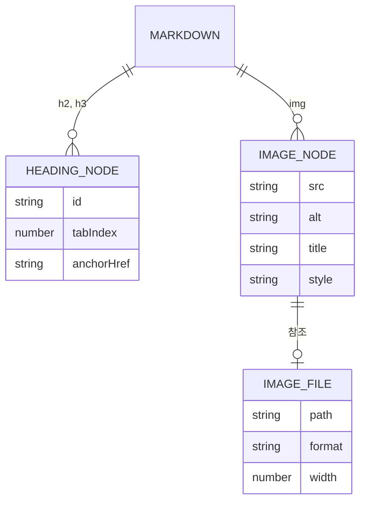

# 본문 렌더링(RENDER) — 도메인 모델

## 엔티티와 값 객체

이 도메인은 저장하는 자료가 아니라 변환 과정을 다룬다. 아래는 마크다운 한 편이 HTML이 되기까지 거치는 노드의 관계다.

| 이름 | 구분 | 역할 |
| --- | --- | --- |
| `HEADING_NODE` | 값 객체 | `heading-anchors`가 `id`, `tabIndex`, 문단 링크를 채운 소제목 노드 |
| `IMAGE_NODE` | 값 객체 | `image-width`가 `title`을 걷어 내고 `style`을 채운 이미지 노드 |
| `IMAGE_FILE` | 엔티티 | 글 폴더에 커밋된 이미지 파일. 경로가 곧 식별자다 |
| `parseWidth` 결과 | 값 객체 | 폭 표기를 해석한 양의 정수 또는 `null` |

### 생명 주기

소제목 노드는 마크다운을 변환할 때 만들어지고, `GithubSlugger`가 문서 안에서 겹치지 않는 슬러그를 부여한다. 이 `id`는 목차 링크와 문단 링크가 함께 가리키는 값이므로, 제목 문구를 바꾸면 앵커 주소도 함께 바뀐다.

이미지 파일은 저자가 글 폴더에 놓는 순간 생기고, `npm run images`를 거치며 WebP로 바뀌면서 원본이 사라진다. 변환은 임시 파일에 먼저 쓴 뒤 원본을 지우고 이름을 바꾸는 순서로 진행하므로, 중간에 실패해도 원본과 결과가 함께 사라지지 않는다. 이후 빌드에서 Astro가 다시 최적화 산출물을 만들어 `dist/`에 넣는다.

## 데이터베이스 스키마

해당 없음. 이 도메인이 다루는 상태는 파일 시스템의 마크다운과 이미지뿐이고, 데이터베이스를 쓰지 않는다. 아래는 그 자리를 대신하는 폴더 규약이다.

### 글 폴더 구조

| 경로 | 타입 | 제약 조건 | 설명 |
| --- | --- | --- | --- |
| `src/content/posts/<경로>/index.md` | 파일 | 필수 | 글 본문. 파일 이름이 `index.md`여야 폴더 경로가 `post.id`가 된다 |
| `src/content/posts/<경로>/<이름>.webp` | 파일 | 선택 | 그 글이 쓰는 이미지. 같은 폴더에 둔다 |

이미지를 `src/` 안에 두는 이유는 Astro의 빌드 최적화를 받기 위해서다. `public/`에 두면 그대로 복사되기만 한다.

### 인덱스와 제약

| 대상 | 종류 | 이유 |
| --- | --- | --- |
| 소제목 `id` | 문서 내 유니크 | `GithubSlugger`가 같은 문구의 제목에 번호를 덧붙여 겹침을 막는다 |
| 이미지 파일 폭 | 상한 1360px | 본문 폭 680px의 두 배. 저장소에 커밋되는 원본 크기를 묶는다 |
| `.webp` 대상 파일 | 덮어쓰기 금지 | 이미 있으면 오류로 끝내 기존 이미지를 잃지 않게 한다 |
| 참조 갱신 범위 | 같은 폴더의 `index.md` | 다른 글의 본문을 건드리지 않는다 |
