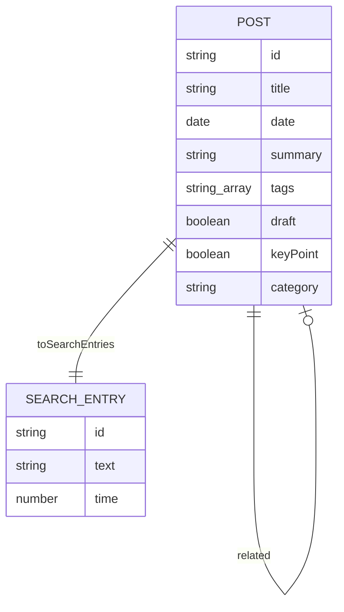

# 콘텐츠(CONTENT) — 도메인 모델

## 엔티티와 값 객체

| 이름 | 구분 | 역할 |
| --- | --- | --- |
| `Post` | 엔티티 | 글 한 편. `src/content/posts` 아래 `index.md` 하나와 대응하며 `id`로 식별한다 |
| `SearchEntry` | 값 객체 | 검색과 정렬에만 쓰는 글의 축약 표현. 화면의 글자가 아니라 이 값으로 검색한다 |
| `MarkdownHeading` | 값 객체 | `render(post)`가 돌려주는 소제목 목록. 목차를 만드는 쪽에서 쓴다 |

### 생명 주기

글은 저자가 `src/content/posts` 아래에 폴더를 만들고 `index.md`를 두는 순간 생긴다. 빌드 시점에 `glob` 로더가 파일을 읽고 Zod 스키마로 검증하며, 검증에 실패하면 빌드가 그 자리에서 멈춘다.

상태 값은 `draft` 하나다. `draft: true`인 글은 개발 서버에서만 목록과 본문 경로에 나타나고 운영 빌드에서는 어느 화면에도 실리지 않는다. `draft`를 `false`로 바꾸는 것이 발행이며 되돌리는 것이 회수다. 파일을 지우면 글도 사라지고, 참조하던 다른 글의 `related`가 깨져 다음 빌드가 예외로 멈춘다.

## 데이터베이스 스키마

해당 없음. 데이터베이스를 쓰지 않는 정적 사이트이고, 글의 원본이 저장소에 커밋된 마크다운 파일 그 자체다. 아래는 그에 대응하는 프론트매터 스키마다.

### `posts` 컬렉션 프론트매터

| 필드 | 타입 | 제약 조건 | 설명 |
| --- | --- | --- | --- |
| `title` | `string` | 필수 | 글 제목. 목록, 머리말, `<title>`에 함께 쓴다 |
| `date` | `Date` | 필수, `z.coerce.date()` | 발행일. 문자열로 적으면 `Date`로 바뀐다 |
| `summary` | `string` | 필수 | 한 줄 요약. 목록과 머리말, `description` 메타에 쓴다 |
| `tags` | `string[]` | 기본값 `[]` | 태그 목록 |
| `draft` | `boolean` | 기본값 `false` | 참이면 운영 빌드에서 제외한다 |
| `keyPoint` | `boolean` | 기본값 `false` | 참이면 지식 맵 후보가 된다 |
| `category` | `string` | 선택 | 지식 맵 노드와 글 머리말에 붙는 영역 이름 |
| `related` | `reference('posts')` | 선택 | 이어 볼 글의 `id`. 없는 글을 적으면 빌드가 멈춘다 |

식별자 `id`는 프론트매터가 아니라 로더가 파일 경로에서 만든다. `src/content/posts/2026/books/소프트웨어 설계의 결합 균형/index.md`의 `id`는 `2026/books/소프트웨어 설계의 결합 균형`이다.

### 인덱스와 제약

| 대상 | 종류 | 이유 |
| --- | --- | --- |
| `post.id` | 유니크 | 파일 경로에서 나오므로 폴더 구조가 중복을 막는다. 글 주소의 유일성도 여기서 나온다 |
| `related` | 참조 무결성 | `reference('posts')`가 형식을, `getRelatedPost`의 예외가 대상 존재 여부를 검사한다 |
| `date` | 정렬 기준 | 모든 목록이 발행일 내림차순을 기본으로 하므로 `getVisiblePosts`가 한 번만 정렬해 뒤로 넘긴다 |
| `**/.obsidian/**` | 로더 제외 규칙 | 옵시디언 설정 폴더의 마크다운이 글로 잡히지 않게 한다 |
