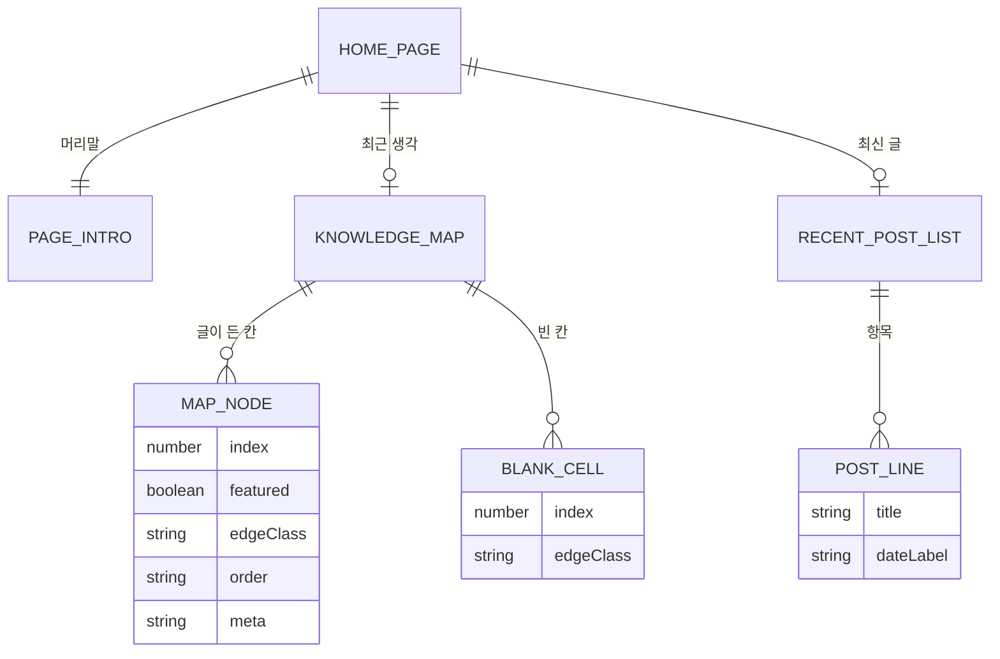

# 홈 화면(HOME) — 도메인 모델

## 엔티티와 값 객체

| 이름 | 구분 | 역할 |
| --- | --- | --- |
| `KnowledgeMap` | 엔티티 | 격자 전체. 빈 칸 수를 셈하고 테두리 방향을 각 칸에 나눠 준다 |
| `MapNode` | 값 객체 | 글이 든 칸 하나. 순번, 제목, 분류와 읽기 시간을 그린다 |
| 빈 칸 | 값 객체 | 링크 없는 칸. 격자 모양을 지키는 자리 채움 |
| `RecentPostList` | 값 객체 | 제목과 날짜만 담는 한 줄 목록 |
| `MAP_EDGE_CLASSES` | 값 객체 | 배치 순서대로 적어 둔 테두리 방향 다섯 개 |

### 생명 주기

홈의 구성 요소는 상태를 갖지 않는다. 빌드 시점에 `getMapPosts`와 `getRecentPosts`가 돌려준 배열을 받아 한 번 그리고 끝난다. 클라이언트 스크립트도 붙지 않으므로, 화면이 바뀌는 유일한 계기는 글을 추가하거나 `keyPoint` 표시를 바꾼 뒤 다시 빌드하는 일이다.

격자의 칸 수는 글 수와 무관하게 언제나 다섯이다. 넘겨받은 글이 먼저 차례로 놓이고 남는 자리를 빈 칸이 이어받으므로, 테두리 방향은 글 수와 상관없이 같은 순서로 적용된다.

## 데이터베이스 스키마

해당 없음. 이 도메인은 자료를 저장하지 않고 [`콘텐츠(CONTENT)`](../콘텐츠(CONTENT)/02_도메인_모델.md)가 돌려준 `Post` 배열을 받아 그리기만 한다. 아래는 그 대신 격자의 배치 규약이다.

### 테두리 방향 규칙

| 배치 순서 | 클래스 | 좁은 화면(2열) | 넓은 화면(3열, 701px 이상) |
| --- | --- | --- | --- |
| 0 | `''` | 그리지 않는다. 첫 행이자 첫 열이다 | 그리지 않는다 |
| 1 | `border-t wide:border-t-0 wide:border-l` | 위쪽 | 왼쪽 |
| 2 | `border-t border-l wide:border-t-0` | 위쪽과 왼쪽 | 왼쪽 |
| 3 | `border-t wide:border-l` | 위쪽 | 위쪽과 왼쪽 |
| 4 | `border-t border-l` | 위쪽과 왼쪽 | 위쪽과 왼쪽 |

### 칸 크기 규약

| 대상 | 좁은 화면 | 넓은 화면 |
| --- | --- | --- |
| 중심 글 | 두 열을 차지, 최소 높이 250px | 첫 열에서 두 행을 차지, 최소 높이 341px, 보조 배경 |
| 일반 노드 | 최소 높이 145px | 최소 높이 170px |
| 빈 칸 | 최소 높이 145px | 최소 높이 170px |
| 격자 열 구성 | `grid-cols-2` | `grid-cols-[1.45fr_1fr_1fr]` |

### 인덱스와 제약

| 대상 | 종류 | 이유 |
| --- | --- | --- |
| `MAP_CELL_COUNT` | 고정값 5 | `MAP_EDGE_CLASSES`의 길이에서 나온다. 방향 규칙과 칸 수가 어긋나지 않게 한 곳에서 파생시킨다 |
| `map-node-title-<post.id>` | 문서 내 유니크 | `aria-labelledby`가 가리키는 제목 요소의 `id` |
| 빈 칸 | `aria-hidden="true"` | 보조 기술이 의미 없는 칸을 읽지 않게 한다 |
| 격자 컨테이너 | `border-y` | 위아래 바깥선을 칸이 아니라 컨테이너가 맡는다 |
