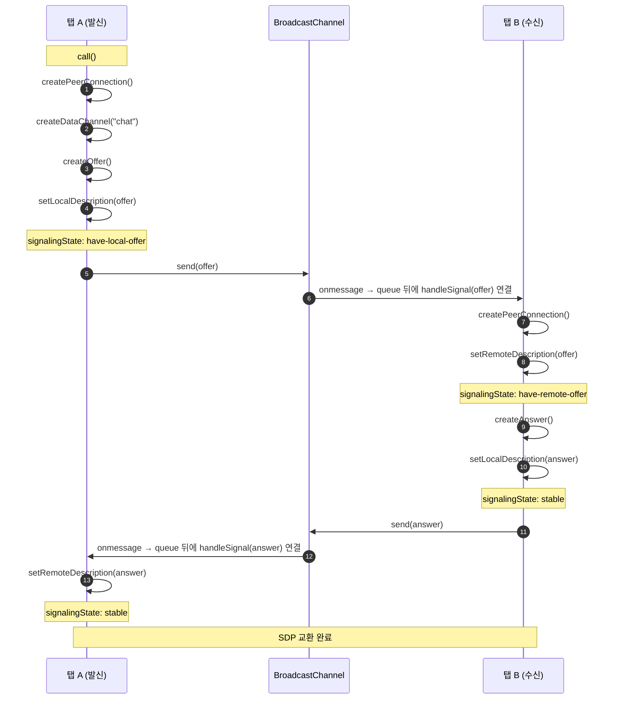

WebRTC Signaling이 어떤 순서로 진행되며 왜 그렇게 동작하는지 설명하는 글이다. 로컬 서버에서 두 개의 탭을 열고 Signaling 과정을 시퀀스 다이어그램으로 정리했다.

송신자와 수신자는 RTCPeerConnection 객체로 생성한 offer와 answer를 서로 교환하며 통신에 필요한 정보를 주고받는다. 이러한 정보 교환 과정을 Signaling이라고 한다. Signaling 순서는 다음과 같다.
## Signaling

### Offer 생성 및 전달 (1 - 5)
채널을 생성하는 측에서는 RTCPeerConnection 객체의 createOffer 메서드를 사용해 offer 정보를 생성한다. 그런 다음 setLocalDescription 메서드로 offer를 설정한다. 이때 RTCPeerConnection 객체의 signalingState가 **stable** 상태에서 **have-local-offer** 상태로 전환된다. 그리고 생성한 offer는 signaling 서버를 통해 수신자에게 전달한다.
### Offer 설정, Answer 생성 및 전달 (6 - 11)
채널을 사용하는 측에서는 RTCPeerConnection 객체를 생성한 뒤, signaling 서버를 통해 받은 offer를 setRemoteDescription 메서드로 설정한다. SignalingState가 **stable** 상태에서 **have-remote-offer** 상태로 전환된다. 이어서 createAnswer 메서드로 answer 정보를 생성하고, setLocalDescription 메서드로 설정한다. 이때 signalingState가 **have-remote-offer** 상태에서 **stable** 상태로 변경된다. 생성한 answer는 signaling 서버를 통해 채널을 생성한 측에 전달한다.
### Answer 설정 (12 - 13)
채널을 생성한 측에서는 받은 answer를 setRemoteDescription 메서드로 설정한다. 그러면 signalingState가 have-local-offer에서 stable로 변경되고, SDP 교환이 완료된다.

위 SDP 교환 과정에는 상태 변경과 작업을 큐에 등록하는 과정이 포함된다. 이 부분이 핵심이다.
## RTCPeerConnection.signalingState
이 상태는 각 피어에서 SDP를 설정할 수 있는 순서를 결정한다. 이를 signalingState 전이 규칙이라고 한다. 채널을 사용하는 측은 have-remote-offer 상태에서 answer를 로컬 설명으로 설정할 수 있고, 채널을 생성한 측은 have-local-offer 상태에서 answer를 원격 설명으로 설정할 수 있다. answer는 offer에 대한 응답이므로 offer를 먼저 적용해야 두 정보를 올바르게 연결할 수 있다. 순서를 지키지 않으면 다음과 같은 오류가 발생한다.

> InvalidStateError: Failed to execute 'setRemoteDescription' on 'RTCPeerConnection': Failed to set remote answer sdp: Called in wrong state: stable
## Queueing
6-11과 12-13 과정은 Queue에 등록해 순서대로 실행한다. 먼저 등록된 작업이 완료된 뒤 다음 작업을 진행해야 하기 때문이다. Queue를 사용하지 않는다고 항상 문제가 발생하는 것은 아니지만, 비동기 함수가 동시에 실행되면 작업 순서가 뒤섞일 수 있다. 이런 상황을 안전하게 처리하려면 Queue를 사용하는 편이 좋다. 예를 들어 setRemoteDescription보다 먼저 addIceCandidate가 실행되면 다음과 같은 오류가 발생한다.

> InvalidStateError: Failed to execute 'addIceCandidate' on 'RTCPeerConnection': The remote description was null
